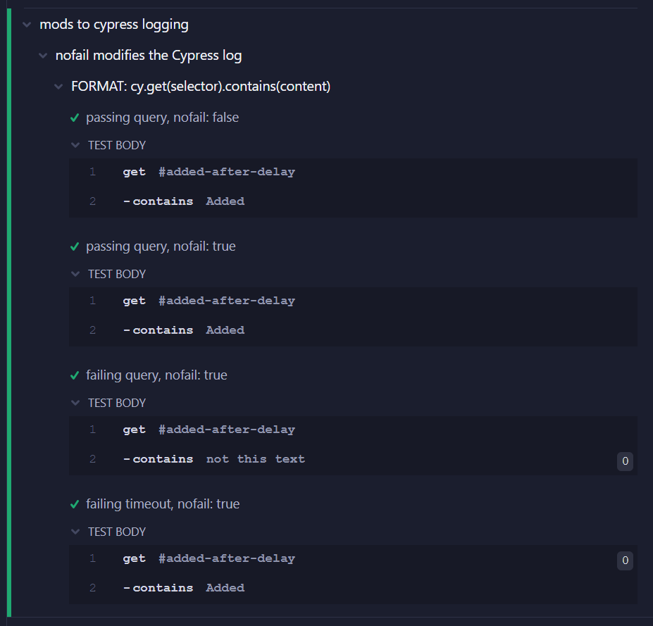

# cypress-pure-query

### Cypress queries that just return a result

Cypress 12 gave query commands a new API, but they still fail the test when the query fails. This is an experimental library that allows queries to be side-effect free, as per the [CommandQuerySeparation](https://martinfowler.com/bliki/CommandQuerySeparation.html) principle:

<dl>
  <dt>Queries:</dt>
  <dd>Return a result and do not change the observable state of the system (are free of side effects)</dd>
  <dt>Commands:</dt>
  <dd>Change the state of a system but do not return a value</dd>
</dl>

Use this library to build features such as  
- **soft-assert**
- **conditional testing**
- **retry with actions**

## Logging

Out of the box, the same Cypress log entries are produced - except that error messages are not output.

If you add the logging module by importing it in the spec or support

```js
import '@src/query/log.js'
````

the Cypress log is enhanced with these artifacts:

- queries with `{nofail:true}` applied are prefixed by `~` instead of the usual `-`
- failing queries are colored orange
- the status tag `(failed)` is added to the description
- queries with a preceding fail are tagged with `(skipped)`

Here is a comparison

| normal logging                                   |  enhanced logging                        |
|:------------------------------------------------:|:----------------------------------------:|
|   |  |


------------------------------------------------------
Author: Fody &lt;FodyF@gmail.com&gt; &copy; 2023
