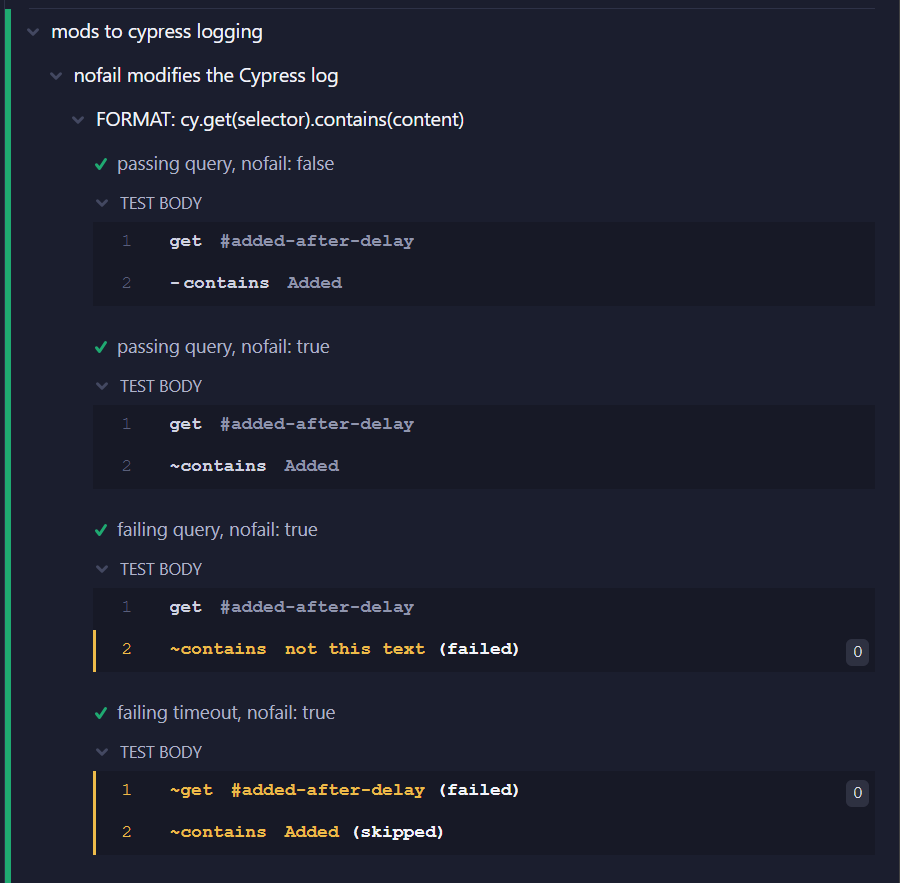

# cypress-pure-query

### Cypress queries that will not fail the test when the query fails.

Cypress 12 gave query commands a new API, but they still fail the test when the query fails. 

This library allows queries to be side-effect free, as per the [CommandQuerySeparation](https://martinfowler.com/bliki/CommandQuerySeparation.html) principle:


<table style="left-margin: 50px; background-color: lightgray">
  <tbody style="left-margin: 50px; background-color: lightgray">
    <tr style="border: none!important; background-color: lightgray">
      <td style="border: none!important; font-weight: 600!important; vertical-align: text-top; ">Queries:</td>
      <td style="border: none!important; font-size: 14px!important">Return a result and do not change the observable state of the system (are free of side effects)</td>
    </tr>
    <tr style="border: none!important; background-color: lightgray">
      <td style="border: none!important; font-weight: 600!important; vertical-align: text-top; ">Commands:</td>
      <td style="border: none!important; font-size: 14px!important">Change the state of a system but do not return a value</td>
    </tr>
  </tbody>
</table>

Use to build Custom Commands for features such as **soft-assertion, conditional test sequences, query retry with actions**

## Logging

Out of the box, the same Cypress log entries are produced - except that error messages are not output.

If you add the logging module by importing it in the spec or support

```js
import '@src/query/log.js'
````

the Cypress log is enhanced with artifacts

- queries with `{nofail:true}` applied are prefixed by `~` instead of the usual `-`
- failing queries are colored orange
- the status tag `(failed)` is added to the description
- queries with a preceding fail are tagged with `(skipped)`

Here is a log sample from the test:



------------------------------------------------------
Author: Fody &lt;FodyF@gmail.com&gt; &copy; 2023
